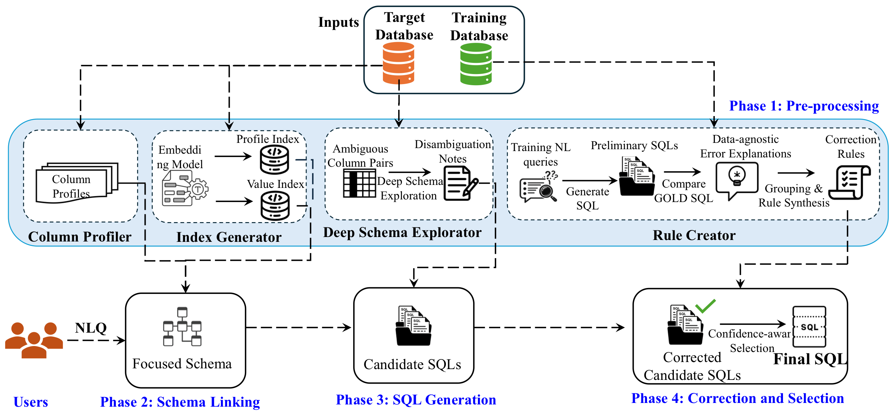

# DexterSQL

**DexterSQL: Deep Schema Exploration & Rule-based Correction for Text-to-SQL Generation**

Anik Pramanik, Murat Kantarcioglu, Vincent Oria, Shantanu Sharma

[Paper](https://arxiv.org/pdf/2608.11889)



## Abstract

Prompting-based (i.e., non-fine-tuning) Text-to-SQL methods, where underlying large language model parameters are not changed for the task, face three problems: (i) relying on coarse-grained schema information that may not reveal the fine-grained relationships needed to distinguish ambiguous columns, (ii) failing to capture recurring SQL-generation failures, and (iii) suffering from omission or hallucination of components in complex questions.

This paper develops DexterSQL, a prompting/non-fine-tuning-based Text-to-SQL system that improves SQL generation with three novel components: (i) deep schema explorator that identifies ambiguous columns, analyzes their individual and joint data distributions to uncover their relationships and the distinct role of each, (ii) database-agnostic rule creator that mines mismatches between generated and gold SQL only on the training database and converts them into database-agnostic corrective rules that capture recurring LLM failure patterns; and (iii) multi-path SQL generation that introduces a dependency-tree-based intermediate representation that uses the question's sentence structure to guide its decomposition into an SQL skeleton for final SQL generation.

DexterSQL achieves a higher accuracy compared to the state-of-the-art using both open-source/weight and closed-source/weight models. Particularly, DexterSQL shows a high improvement of at least 5.5% using an open-weight model (GPT-OSS-120B) on BIRD-Dev, with total accuracy 70.4%. DexterSQL also shows better improvement of at least 1.4% using closed-weight models, with total accuracy 72.1% and 72.9% on BIRD-Dev with GPT-4o and GPT-5.2.

## Installation

Use Python 3.9 or newer.

```bash
pip install -r requirements.txt
python -m spacy download en_core_web_sm
```

## Quickstart

Run the included local example without an LLM server:

```bash
python examples/quickstart.py
```

To print the prompt used by the quickstart:

```bash
python examples/quickstart.py --show-prompt
```

To run the smoke test directly:

```bash
python tests/test_smoke.py
```

## Live Model Run

DexterSQL can call an OpenAI-compatible endpoint.

```bash
python examples/quickstart.py --live \
  --model <MODEL_ID> \
  --base-url <LLM_BASE_URL>
```

If the endpoint needs an API key:

```bash
export DEXTERSQL_API_KEY=<API_KEY>
python examples/quickstart.py --live \
  --model <MODEL_ID> \
  --base-url <LLM_BASE_URL>
```

## BIRD Evaluation

Create a config file from the template and fill in the local paths, model name, endpoint, and API key values.

```bash
cp config/bird.toml.template config/bird.toml
```

The example runner contains the full command sequence for a BIRD-Dev run:

```bash
bash scripts/run_full_pipeline.example.sh
```

Before running it, set the placeholders inside the script for:

- repository path
- BIRD dev database path
- BIRD dev JSON path
- workspace and results directories
- optional few-shot JSON path
- model name and endpoint

## Configuration

The main template is:

```text
config/bird.toml.template
```

Copy it to `config/bird.toml`, then update the dataset, workspace, model, and credential settings for your environment.
